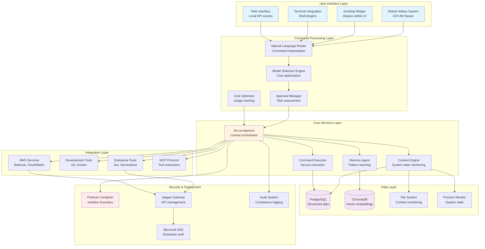
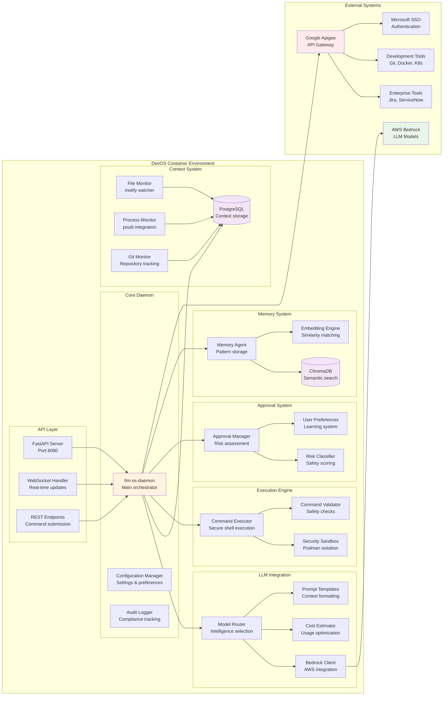
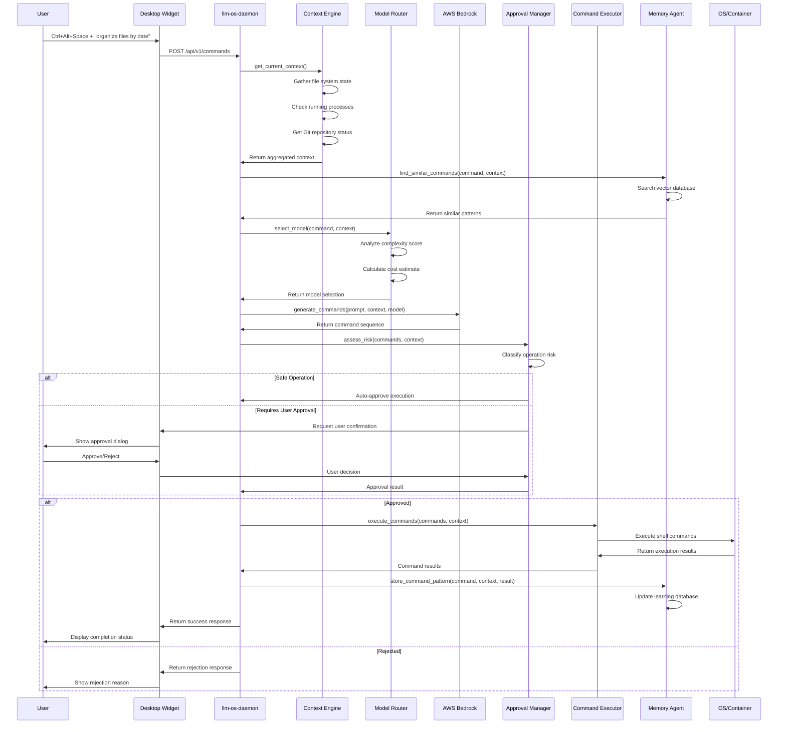
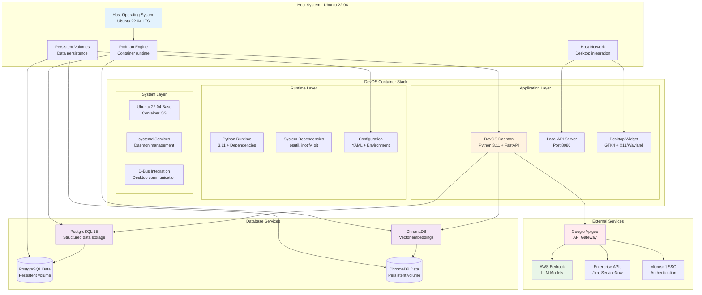
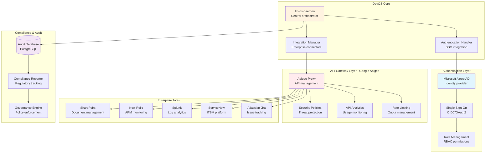
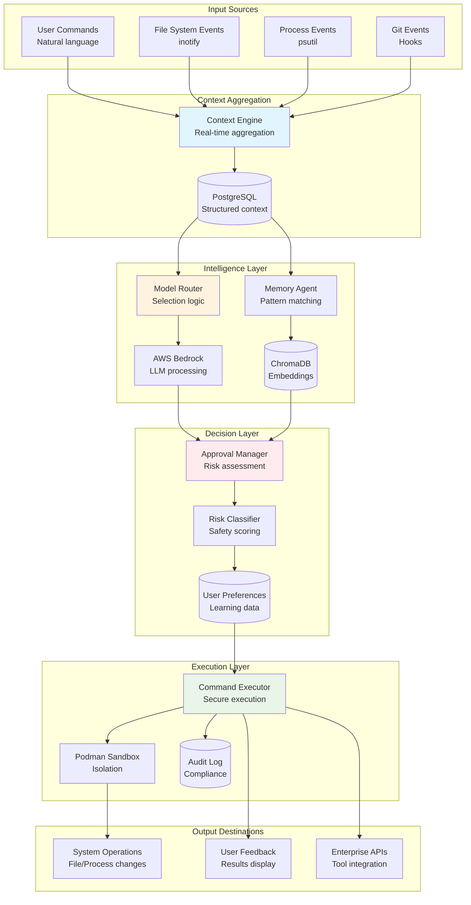
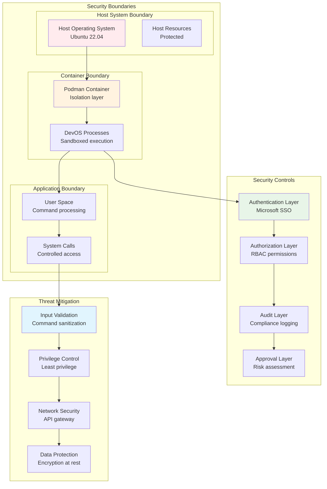

# DevOS System Architecture Diagrams

## High-Level System Architecture

## Detailed Component Architecture with Data Flows

## Command Processing Sequence Diagram

## Container Deployment Architecture

## Enterprise Integration Architecture

## Data Flow Architecture

## Security Architecture

