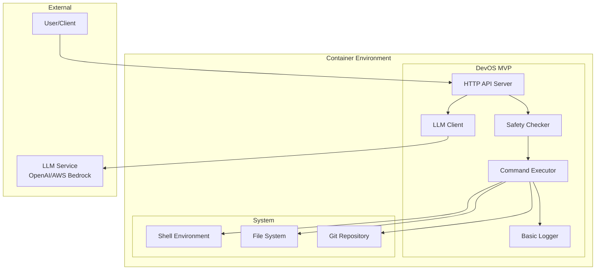

# Design Document

## Overview

This design document outlines the MVP (Minimum Viable Product) for DevOS to validate the core concept of OS-native LLM capabilities. The MVP focuses on proving that natural language can effectively control system operations in a containerized environment.

The MVP will demonstrate the fundamental value proposition: an operating system with native LLM integration can provide transformative developer experiences through natural language system control, going beyond what application-level AI assistants can achieve.

## Architecture

### MVP System Architecture



## Components and Interfaces

### Core Components (MVP)

#### 1. HTTP API Server
- **Purpose**: Accept natural language commands via REST API
- **Technology**: FastAPI
- **Endpoints**:
  - `POST /command` - Submit natural language command
  - `GET /health` - Health check
  - `GET /history` - Basic command history
- **Input**: JSON with natural language command
- **Output**: JSON with command result or approval request

#### 2. LLM Client
- **Purpose**: Convert natural language to shell commands
- **Technology**: OpenAI API or AWS Bedrock
- **Functionality**:
  - Send natural language to LLM with system prompt
  - Parse LLM response to extract shell commands
  - Handle API errors and retries
- **Configuration**: Single model selection (GPT-4 or Claude)

#### 3. Safety Checker
- **Purpose**: Classify commands as safe or requiring approval
- **Logic**:
  - Safe: ls, cat, pwd, git status, find (read-only operations)
  - Requires approval: rm, mv, chmod, git commit, sudo (write operations)
- **Implementation**: Simple keyword matching and pattern recognition

#### 4. Command Executor
- **Purpose**: Execute shell commands safely within container
- **Technology**: Python subprocess with security controls
- **Features**:
  - Execute commands in controlled environment
  - Capture stdout/stderr
  - Timeout protection
  - Working directory management

#### 5. Basic Logger
- **Purpose**: Log commands and results for debugging
- **Storage**: Simple file-based logging
- **Format**: JSON logs with timestamp, command, result, status
## Data Models

### MVP Data Models

```python
from dataclasses import dataclass, field
from datetime import datetime
from typing import Optional, List

@dataclass
class CommandRequest:
    command: str
    user_id: str = "default_user"
    timestamp: datetime = field(default_factory=datetime.now)

@dataclass
class CommandResponse:
    success: bool
    output: str
    error: Optional[str] = None
    requires_approval: bool = False
    executed_commands: List[str] = field(default_factory=list)
    timestamp: datetime = field(default_factory=datetime.now)

@dataclass
class CommandLog:
    id: int
    command: str
    shell_commands: List[str]
    output: str
    success: bool
    timestamp: datetime
    user_id: str = "default_user"

@dataclass
class SafetyClassification:
    is_safe: bool
    risk_level: str  # "safe", "moderate", "destructive"
    requires_approval: bool
    reason: str
```

## Error Handling

### MVP Error Handling

**Simple Error Categories**:
- **LLM Errors**: API failures, invalid responses
- **Command Errors**: Shell command failures, permission issues
- **System Errors**: Container issues, service failures

**Basic Recovery**:
```python
def handle_error(error: Exception) -> str:
    if isinstance(error, LLMError):
        return "LLM service unavailable. Please try again."
    elif isinstance(error, CommandError):
        return f"Command failed: {error.message}"
    else:
        return "System error occurred. Check logs."
```

## Testing Strategy

### MVP Testing Approach

**Focus Areas**:
1. **API Endpoints**: Test command submission and response
2. **LLM Integration**: Mock LLM responses for consistent testing
3. **Command Execution**: Test shell command generation and execution
4. **Safety Checks**: Verify approval system works for destructive commands
5. **Container Deployment**: Ensure system starts and runs correctly

**Test Structure**:
```python
def test_safe_command():
    response = api_client.post("/command", json={"command": "list files"})
    assert response.status_code == 200
    assert "ls" in response.json()["executed_commands"]

def test_destructive_command():
    response = api_client.post("/command", json={"command": "delete all files"})
    assert response.json()["requires_approval"] == True
```

## Deployment

### MVP Container Setup

**Podman Compose Configuration**:
- FastAPI application container
- Basic file-based logging
- Environment variable configuration
- Health checks for service validation

**Installation Process**:
1. Clone repository
2. Set environment variables (LLM API keys)
3. Run `podman-compose up`
4. Test with basic commands via API

This MVP validates the core concept before building enterprise features.

