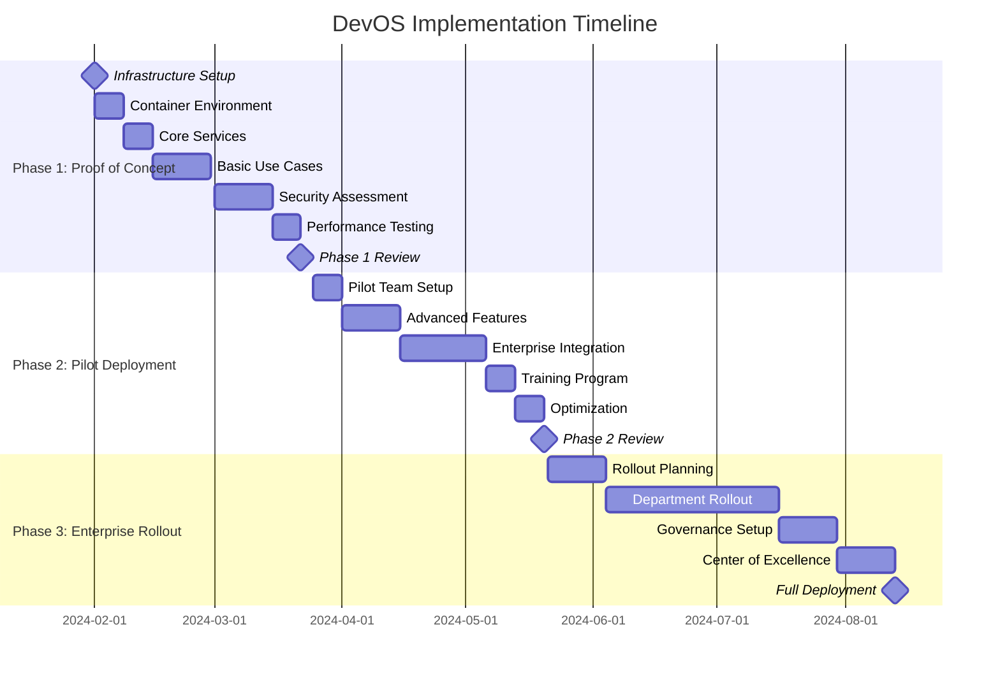

# DevOS Implementation Timeline and Milestones
*Detailed Project Plan for Leadership Review*

## Executive Summary

**Total Duration**: 28 weeks (7 months)  
**Total Investment**: $105,000  
**Expected ROI**: 2,031% with 17-day payback period  
**Team Size**: 5-25 developers (scaling by phase)  

## Phase Overview

---

## Phase 1: Proof of Concept (8 weeks)

### Objectives
- Validate core DevOS functionality in containerized environment
- Demonstrate security model and compliance capabilities
- Establish performance benchmarks and cost models
- Prove technical feasibility for enterprise deployment

### Team Composition
- **Project Manager**: 1 FTE
- **DevOps Engineers**: 2 FTE
- **Security Engineer**: 1 FTE
- **Developer (Testing)**: 1 FTE
- **Total**: 5 FTE

### Budget Allocation: $35,000
- Personnel (5 FTE × 8 weeks): $32,000
- Infrastructure and tools: $2,000
- Security assessment: $1,000

### Week-by-Week Breakdown

#### Week 1: Infrastructure Foundation
**Deliverables**:
- [ ] Podman container environment configured
- [ ] PostgreSQL 15 database deployed and configured
- [ ] ChromaDB vector database setup
- [ ] Basic monitoring and logging infrastructure

**Key Activities**:
- Set up Ubuntu 22.04 base environment
- Configure Podman with security hardening
- Deploy database containers with persistent storage
- Establish backup and recovery procedures

**Success Criteria**:
- All containers running and healthy
- Database connectivity verified
- Basic monitoring dashboards operational

#### Week 2: Core Service Deployment
**Deliverables**:
- [ ] DevOS daemon service running
- [ ] AWS Bedrock integration functional
- [ ] Basic API endpoints responding
- [ ] Desktop widget prototype

**Key Activities**:
- Deploy llm-os-daemon with all core components
- Configure AWS Bedrock authentication and model access
- Implement basic REST API and WebSocket endpoints
- Create minimal desktop widget for testing

**Success Criteria**:
- Daemon starts without errors
- Successful LLM model calls to Bedrock
- API health checks passing
- Widget can submit basic commands

#### Week 3-4: Core Use Case Implementation
**Deliverables**:
- [ ] File system operations working
- [ ] Git workflow automation functional
- [ ] System monitoring capabilities
- [ ] Basic approval workflow

**Key Activities**:
- Implement file organization use case
- Build Git integration with branch creation
- Add process monitoring and analysis
- Create approval system for destructive operations

**Success Criteria**:
- File organization demo working end-to-end
- Git branch creation with intelligent naming
- Process analysis with dependency mapping
- Approval workflow preventing unauthorized operations

#### Week 5-6: Security Assessment
**Deliverables**:
- [ ] Container security validation
- [ ] Penetration testing report
- [ ] Audit logging verification
- [ ] Compliance assessment

**Key Activities**:
- Conduct container escape testing
- Perform network security assessment
- Validate audit trail completeness
- Test approval workflow security

**Success Criteria**:
- Zero critical security vulnerabilities
- Container isolation verified
- Complete audit trails for all operations
- Approval system prevents privilege escalation

#### Week 7-8: Performance Validation
**Deliverables**:
- [ ] Performance benchmarks
- [ ] Load testing results
- [ ] Cost analysis validation
- [ ] Optimization recommendations

**Key Activities**:
- Conduct response time testing
- Perform concurrent user load testing
- Validate cost optimization algorithms
- Identify performance bottlenecks

**Success Criteria**:
- Sub-3-second response times for 95% of commands
- Support for 10+ concurrent users
- Cost per command under $0.05
- Clear optimization roadmap

### Phase 1 Success Metrics
- ✅ **Functionality**: All core use cases working
- ✅ **Security**: Zero critical vulnerabilities
- ✅ **Performance**: <3s response time, 10+ concurrent users
- ✅ **Cost**: <$0.05 per command
- ✅ **Reliability**: 99%+ uptime during testing

### Go/No-Go Decision Criteria
**GO Criteria** (must meet all):
- All core use cases demonstrated successfully
- Security assessment passed with no critical issues
- Performance meets or exceeds targets
- Cost model validated and sustainable
- Team confidence in enterprise scalability

**NO-GO Criteria** (any one triggers):
- Critical security vulnerabilities discovered
- Performance significantly below targets
- Cost model unsustainable at scale
- Technical blockers for enterprise features

---

## Phase 2: Pilot Deployment (8 weeks)

### Objectives
- Scale to 25-developer pilot team across multiple departments
- Implement advanced enterprise integration features
- Validate user adoption and satisfaction metrics
- Establish training and support processes

### Team Composition
- **Project Manager**: 1 FTE
- **DevOps Engineers**: 2 FTE
- **Backend Developers**: 2 FTE
- **Integration Specialist**: 1 FTE
- **Training Coordinator**: 0.5 FTE
- **Total**: 6.5 FTE

### Budget Allocation: $45,000
- Personnel (6.5 FTE × 8 weeks): $41,600
- Enterprise tool licenses: $2,000
- Training materials development: $1,400

### Pilot Team Selection
**Department Distribution**:
- Backend Development Team: 10 developers
- Frontend Development Team: 8 developers
- DevOps/Infrastructure Team: 7 developers

**Selection Criteria**:
- Mix of senior and junior developers
- Representatives from each major project
- Volunteers with positive attitude toward new tools
- Technical leaders who can become champions

### Week-by-Week Breakdown

#### Week 1: Pilot Environment Setup
**Deliverables**:
- [ ] Pilot environment deployed
- [ ] User accounts and permissions configured
- [ ] Monitoring dashboards for pilot team
- [ ] Feedback collection system

**Key Activities**:
- Scale infrastructure for 25 concurrent users
- Configure user authentication and authorization
- Set up usage monitoring and analytics
- Establish feedback channels and support processes

#### Week 2-3: Advanced Feature Implementation
**Deliverables**:
- [ ] Complex workflow automation
- [ ] Multi-tool orchestration
- [ ] Advanced context awareness
- [ ] Custom integration framework

**Key Activities**:
- Implement complex multi-step workflows
- Build orchestration between multiple development tools
- Enhance context engine with project-specific awareness
- Create framework for custom enterprise integrations

#### Week 4-6: Enterprise Integration
**Deliverables**:
- [ ] Jira integration fully functional
- [ ] ServiceNow connector implemented
- [ ] Microsoft SSO authentication
- [ ] Apigee API gateway integration

**Key Activities**:
- Develop and test Jira ticket creation and management
- Implement ServiceNow change request automation
- Configure Microsoft Azure AD authentication
- Set up Apigee for API management and security

#### Week 7: Training and Documentation
**Deliverables**:
- [ ] Comprehensive user training program
- [ ] Administrator documentation
- [ ] Troubleshooting guides
- [ ] Best practices documentation

**Key Activities**:
- Conduct training sessions for all pilot users
- Create video tutorials and documentation
- Develop troubleshooting and FAQ resources
- Document best practices and usage patterns

#### Week 8: Performance Optimization
**Deliverables**:
- [ ] Performance optimization for 25 users
- [ ] Database query optimization
- [ ] Caching implementation
- [ ] Resource allocation tuning

**Key Activities**:
- Optimize system performance for pilot scale
- Implement caching for frequently accessed data
- Tune database queries and indexing
- Optimize resource allocation and limits

### Phase 2 Success Metrics
- ✅ **User Adoption**: 80% of pilot users actively using DevOS
- ✅ **Satisfaction**: >4.0/5.0 user satisfaction score
- ✅ **Performance**: Support 25 concurrent users with <3s response
- ✅ **Integration**: All enterprise tools working seamlessly
- ✅ **Productivity**: 50% reduction in context switching measured

### Pilot Feedback Collection
**Weekly Surveys**:
- Usage frequency and patterns
- Feature satisfaction ratings
- Performance and reliability feedback
- Suggestions for improvement

**Metrics Tracking**:
- Commands per user per day
- Response time distribution
- Error rates and types
- Cost per user per day

---

## Phase 3: Enterprise Rollout (12 weeks)

### Objectives
- Deploy DevOS to 100+ developers across entire organization
- Implement enterprise governance and compliance features
- Establish center of excellence and ongoing support
- Achieve full ROI realization and business benefits

### Team Composition
- **Project Manager**: 1 FTE
- **DevOps Engineers**: 3 FTE
- **Support Engineers**: 2 FTE
- **Training Team**: 2 FTE
- **Governance Specialist**: 1 FTE
- **Total**: 9 FTE

### Budget Allocation: $25,000
- Personnel (9 FTE × 12 weeks): $21,600
- Governance and compliance tools: $2,000
- Training and change management: $1,400

### Department Rollout Schedule

#### Weeks 1-2: Rollout Planning
**Deliverables**:
- [ ] Detailed rollout plan by department
- [ ] Change management strategy
- [ ] Resource allocation plan
- [ ] Risk mitigation procedures

**Key Activities**:
- Prioritize departments based on readiness and impact
- Develop change management and communication plan
- Allocate resources and support capacity
- Prepare rollback procedures for issues

#### Weeks 3-4: Backend Development Teams (30 developers)
**Deliverables**:
- [ ] Backend teams fully onboarded
- [ ] Custom integrations for backend workflows
- [ ] Performance validated at scale
- [ ] Support processes established

#### Weeks 5-6: Frontend Development Teams (25 developers)
**Deliverables**:
- [ ] Frontend teams onboarded
- [ ] UI/UX workflow integrations
- [ ] Cross-team collaboration features
- [ ] Performance monitoring at 55+ users

#### Weeks 7-8: DevOps and Infrastructure Teams (20 developers)
**Deliverables**:
- [ ] DevOps teams onboarded
- [ ] Infrastructure automation integrations
- [ ] Monitoring and alerting workflows
- [ ] System administration features

#### Weeks 9-10: Enterprise Governance Implementation
**Deliverables**:
- [ ] Enterprise approval workflows
- [ ] Compliance monitoring and reporting
- [ ] Cost management and budgeting
- [ ] Security policy enforcement

**Key Activities**:
- Implement multi-level approval workflows
- Set up compliance monitoring and automated reporting
- Configure cost controls and budget alerts
- Enforce security policies and access controls

#### Weeks 11-12: Center of Excellence
**Deliverables**:
- [ ] Internal champion network established
- [ ] Advanced training programs
- [ ] Custom integration development capability
- [ ] Continuous improvement process

**Key Activities**:
- Train internal champions and super users
- Establish ongoing training and certification programs
- Build capability for custom integration development
- Implement feedback loops and continuous improvement

### Phase 3 Success Metrics
- ✅ **Adoption**: 80% of target developers actively using DevOS
- ✅ **Performance**: System supports 100+ concurrent users
- ✅ **ROI**: Full $2.2M annual benefits realized
- ✅ **Governance**: All compliance requirements met
- ✅ **Sustainability**: Center of excellence operational

---

## Risk Management and Mitigation

### High-Risk Items and Mitigation Strategies

| Risk | Probability | Impact | Mitigation Strategy |
|------|-------------|--------|-------------------|
| **Security Vulnerability** | Medium | High | Continuous security testing, third-party assessments |
| **Performance Issues** | Medium | Medium | Load testing, performance monitoring, optimization |
| **User Adoption Resistance** | Low | High | Change management, training, champion network |
| **AWS Service Outage** | Low | Medium | Fallback mechanisms, local model deployment |
| **Integration Failures** | Medium | Medium | Thorough testing, fallback procedures |
| **Budget Overrun** | Low | Medium | Regular budget reviews, scope management |

### Checkpoint Reviews

**Week 4 Checkpoint**: Infrastructure and core functionality
- Review: Technical architecture and basic functionality
- Decision: Continue to security assessment or address issues

**Week 8 Checkpoint**: Security and performance validation
- Review: Security assessment results and performance benchmarks
- Decision: Proceed to pilot or address critical issues

**Week 12 Checkpoint**: Pilot team feedback
- Review: User adoption, satisfaction, and productivity metrics
- Decision: Proceed to enterprise rollout or extend pilot

**Week 20 Checkpoint**: Enterprise rollout progress
- Review: Deployment progress and user adoption across departments
- Decision: Continue rollout or adjust strategy

---

## Success Metrics and KPIs

### Technical Metrics
- **Response Time**: <3 seconds for 95% of commands
- **Availability**: 99.9% uptime
- **Concurrent Users**: Support 100+ users simultaneously
- **Error Rate**: <1% command failure rate

### Business Metrics
- **User Adoption**: 80% of target developers actively using DevOS
- **Productivity Gain**: 40% reduction in routine development tasks
- **Cost Efficiency**: <$0.05 per command average cost
- **ROI**: 2,000%+ return on investment

### User Experience Metrics
- **Satisfaction Score**: >4.0/5.0 in user surveys
- **Training Completion**: 95% within 30 days
- **Support Tickets**: <5 per week after 90 days
- **Feature Utilization**: 70% of features used by 50% of users

---

## Post-Implementation Support

### Ongoing Operations Team
- **DevOps Engineer**: 1 FTE for system maintenance
- **Support Engineer**: 0.5 FTE for user support
- **Training Coordinator**: 0.25 FTE for ongoing training

### Continuous Improvement Process
- Monthly user feedback collection
- Quarterly performance reviews
- Semi-annual security assessments
- Annual ROI and business impact analysis

### Long-term Roadmap
- **Year 1**: Stabilization and optimization
- **Year 2**: Advanced AI features and expanded integrations
- **Year 3**: Multi-site deployment and advanced analytics

This implementation timeline provides a comprehensive roadmap for DevOS deployment, with clear milestones, success criteria, and risk mitigation strategies to ensure successful enterprise adoption.